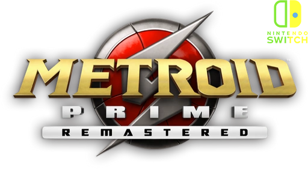

> Status do Projeto: :heavy_check_mark: (Em andamento)
## BAIXAR :link: [v0.3-alpha](https://github.com/JUNIORGBJ/Metroid_Prime_Remastered_PT-BR/releases/download/v0.3-alpha/Metroid_Prime_Remastered_NINTENDO.SWITCH.v0.3-alpha.zip)

<h1 align="center"><figure>
  
</figure></h1>

## :small_blue_diamond:Sobre a Tradução.

⚠Adaptação/Port/Tradução, devido a complexidade dos arquivos da tradução para Game Cube⚠

_ "Adaptação/Port/Tradução do Jogo para Nintendo Switch por Traduções GBJ" _

_ "Tradução do Jogo para Game Cube por BR Traduções" _


## :small_blue_diamond:Por quê?

Este projeto irá ajudar muitas pessoas a entender melhor a história do jogo, portanto ficarei feliz se você puder ajudar de alguma forma o projeto, tradução, erros ortográficos e revisão em jogo!

## :small_blue_diamond:Requerimentos

- Nintendo Switch Desbloqueado - ATMOSPHERE>

## :small_blue_diamond:Instalação

**ATMOSPHERE** Basta colocar a pasta ```010012101468C000``` no caminho ```Atmosphere\Contents``` para quem usa esse desbloqueio

## :small_blue_diamond:Ferramentas Ultilizadas

:link: [Visual Studio Code](https://code.visualstudio.com)

## :small_blue_diamond:Doações

[](https://picpay.me/gilsongbj)

Obrigado!:wave:
